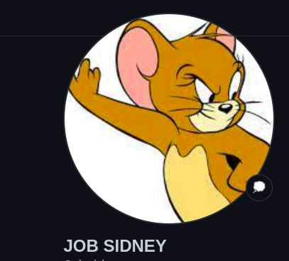

# MOVIE-THEATERS
***
## DESCRIPTION
This is a Movie website that displays a list of movies to the user and more details so that they can choose what type of movie to watch. It covers all age groups from children(animations) to adults (Movies).
 example:
<br  />
## Site:
A working demo of a Section of this Web page: https://jobsidney.github.io/Movie-Theatres/
<br  />

When you visit the site, this is the view:
  

<br  />
### Movie_section
Example:

### News_section
Example:


## [Features](https://jobsidney.github.io/Movie-Theatres/)

- Well Designed Interface(UI).
- intensive use of Vanilla css for design
- Javascript
- HTML5
- API intergration
- Switch to multiple categories via buttons
- Responsive to variety of devices like mobile,tablet and PC


## [InstallationInstructions](https://jobsidney.github.io/Movie-Theatres/) 
Click on the provided link that will direct you to the website
#### requirements:
- chrome browser/any other browser
- any type of computer(phone of laptop)
- Internet connection
- Navigate to the git repository
 - clone the repo to local machine
 - run it on VScode , on live server

## Target to future improvement
- Incoperate JQuery,Nodejs
- Add animated effects
- Add communication bot to enable cliants add reviews automatically.

### Program Sample
#### Html code
```Html
        <nav>
            <ul>
                <li class="navigators"><a href="#nav">Home</a></li>
                <li class="navigators"><a href="#horizontal">Movies</a></li>
                <li class="navigators"><a href="#blogs">News</a></li>
            </ul>
        </nav>
```

#### Css
    Example of Css
```Css
nav>ul>li{
    padding-left: 50px;
    font-size: 3rem;
    color: white;
    font-weight: 800;
    opacity: 0.6;
}
a{
    color: white;
    /* text-decoration: none; */
}
```
#### Javascript
    Example of working javascript code
```Javascript
function movieData(url){
    fetch(url)
    .then(response => response.json())
    .then(data => {
        console.log(data.results);
        displayCard(data.results)
        
    })
```
## PROJECT AUTHOR
- Jobsidney
- [](https://github.com/Jobsidney/)
***

## license information.
### The MIT License
[](https://opensource.org/licenses/MIT)  
`[](https://opensource.org/licenses/MIT)`
